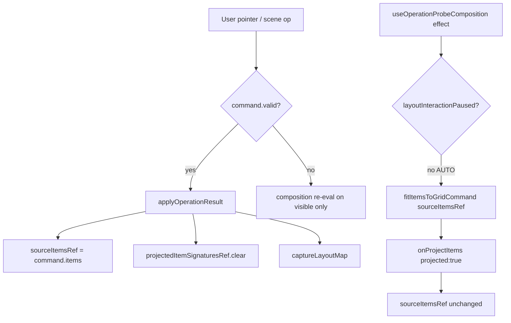

# RELATION-HIERARCHY-AUDIT-1

Аудит архитектуры parent-child responsive layout для Danko Adaptive Engine.

**Статус:** только анализ. Runtime behavior, sidebar/mobile и реализация иерархии **не менялись**.

**Дата:** 2026-05-23  
**Ветка:** `master`

---

## Цель будущей фичи

Безопасно добавить иерархию связей между workspace-блоками:

| Слой | Пример |
|------|--------|
| Parent block | `content`, `sidebar` shell, секция страницы |
| External child blocks | Отдельные workspace items, привязанные к parent |
| Internal child content | `meta.sidebar.content.items`, icon-strip items и т.п. |
| Responsive stacking | Узкая/mobile укладка детей под parent |
| Desktop restore | Возврат source `x/y/w/h` при широком viewport |
| Manual override | После ручного drag пользователя auto-projection не перетирает позицию |

---

## 1. Current source / projection flow

### Термины

| Термин | Где живёт | Смысл |
|--------|-----------|--------|
| **Visible items** | React state `items` в `useGridOperationProbe` | То, что рисует operation probe сейчас |
| **Source items** | `sourceItemsRef.current` | «Авторская» сцена для restore и V2 |
| **Source metrics** | `sourceMetricsRef.current` | Метрики viewport, в котором зафиксирован source |
| **Projection** | `fitItemsToGridCommand` → `fitSceneItemsToGrid` | Пересчёт footprint блоков под текущие `metrics` без смены source |

Контракт origin: `engine-adapter/scene/sceneSourceProjectionState.js`

- `SCENE_ITEM_UPDATE_ORIGINS.SOURCE` — commit в source (ручная правка, geometry operation).
- `SCENE_ITEM_UPDATE_ORIGINS.PROJECTION` — только visible layer (`setItems(..., { projected: true })`).

### Probe lifecycle (`useGridOperationProbe.js`)



**Ключевые правила:**

1. **Ручная операция** (`applyOperationResult`): обновляет и visible, и `sourceItemsRef`, сбрасывает `projectedItemSignaturesRef`, переснимает layout map.
2. **Auto projection** (`applyProjectedItems` через `onProjectItems`): обновляет только visible; `markProjectedItems` явно пишет «авторская карта не изменена».
3. **Effect на `items`**: если signature в `projectedItemSignaturesRef` — ref source **не** перезаписывается (защита от feedback loop после projection).

Подтверждение тестами: `src/editor-surface/operations/operationProbeSourceStateCases.js` — narrow projection меняет visible, restore на desktop metrics возвращает source geometry.

### Adapter fit pipeline (`fitItemsToGridCommand` → `fitSceneItemsToGrid.js`)

1. `createSidebarSceneProjection` — sidebar участвует в layout occupancy, но internal content **не** попадает в `placeLayoutItems`.
2. `fitLayoutItemsToGrid` — per-item `fitLayoutItemGeometry` (edge stretch по `sourceMetrics`) + `placeLayoutItems` (collision resolve по priority).
3. `mergeScopedSceneItems` — в source подставляются только изменённые **workspace** footprints; sidebar internal meta не трогается.

**Sidebar exception:** `shouldPreserveSidebarSourceGeometry` — для fixed top-bar viewport item `x/y/w/h` в source остаются desktop footprint, меняется только render occupancy path (`resolveSidebarLayoutOccupancy`). Это отдельный мир от workspace parent-child.

---

## 2. Current composition relation flow

### Entry: `evaluateCompositionPlanCommand.js`

Прокси в `composition-engine/resolveCompositionPlan.js`:

1. `createCompositionContext` — `items`, `metrics`, `sourceMetrics`, `contentSchemas`, `dependencies`, `relationships`, `policy`.
2. `resolveCompositionBlock` — footprint + `dependencies` из `context.dependencies[item.id]`.
3. `resolveCompositionGroups` — вертикальные «ряды» по overlap по Y, horizontal row / full-width band.
4. `resolveCompositionRelations` — семантические связи (sidebar↔content, control→content, …) + `context.relationships`.
5. `resolveDeviceComposition` — сигналы mobile stack / tablet wrap (пока **advisory**, не layout engine).

### Откуда берутся `dependencies`

| Источник | Файл | Формат |
|----------|------|--------|
| Scene items | `operationProbeSceneData.js` → `createDependenciesFromItems` | `meta.dependencies` \| `meta.dependsOn` \| `meta.linkedTo` → `string[]` target ids |
| Runtime snapshot | `composition-engine/runtimeSnapshotToCompositionInput.js` | `relationships[]` → нормализуется в `dependencies` map |

В `resolveCompositionRelations` массив `dependencies` на блоке влияет только на **confidence** (`control→content`, `warning→content`), не на координаты.

### Группы и stacking (сегодня)

`resolveCompositionGroups.js`:

- Кластеризация по вертикальному overlap (эвристика «одна строка»).
- `shouldWrapGroup` → issue `HORIZONTAL_GROUP_NEEDS_WRAP` + proposal `wrap-horizontal-group`.
- **Нет** persisted parentId, **нет** ordered children, **нет** write-back в scene.

`resolveDeviceComposition.js` — `MOBILE_STACK_REQUIRED` для `HORIZONTAL_ROW` на mobile profile — снова сигнал для человека/V2, не алгоритм укладки.

### V2 fix path (`applyCompositionFixCommand.js`)

1. `fitItemsToGridCommand` → candidate geometry.
2. `resolveRuntimeCandidate` — geometry valid + composition plan valid.
3. При accept — `runtime.items` становятся visible; source обновляется только если probe применяет результат как source op.

**Вывод:** composition-engine сегодня — **диагностика и proposals**, не persistence hierarchy.

---

## 3. Current layout-map restore flow

### Capture (`useOperationProbeLayoutMap.js`)

- При mount и после каждой **source** операции: `createAdapterLayoutMap({ items, metrics })`.
- Карта строится из **текущих** `x/y/w/h` (`adaptive-engine/layout-map/createLayoutMap.js`):
  - per-item `edges`, `anchors` (прижатие к краям grid),
  - `relations` = geometric neighbors (`detectItemRelations.js`: left/right/top/bottom-neighbor + gap).

### Apply (`applyResponsiveLayoutMapCommand.js` → `resolveResponsiveMap.js`)

- Для каждого map item: старт с `mapItem.source` (snapshot geometry).
- Если anchor left+right → растянуть `w` под новые `columns`.
- Если anchor top+bottom → растянуть `h`.
- Иначе — сдвиг к противоположному краю при single-side anchor.

**Ограничения:**

- Не делает collision resolution между блоками (`placeLayoutItems` не вызывается).
- Не знает parent-child — только per-block anchors.
- Не восстанавливает порядок stacking группы.

### Связь с probe

| Событие | Layout map |
|---------|------------|
| Source edit | `captureLayoutMap` — новая карта |
| Projection only | `markProjectedItems` — карта **не** обновляется |
| Metrics change (AUTO) | `fitItemsToGrid` на source, не `applyResponsiveLayoutMap` напрямую |

**Desktop restore сегодня:** `fitItemsToGrid({ items: sourceItems, metrics: desktop, sourceMetrics: desktop })` — `fitLayoutItemGeometry` возвращает edge-stretched позиции к sourceMetrics; для блоков без full-edge stretch — совпадение с source (`operationProbeSourceStateCases.js`).

Layout map overlay — визуализация (`GridLayoutMapOverlay.jsx`), не primary restore path в probe.

---

## 4. Existing dependency model via `meta.dependencies`

### Нормализация

`operationProbeSceneData.js`:

```js
item.meta.dependencies | item.meta.dependsOn | item.meta.linkedTo  // string[]
```

### Использование

| Потребитель | Роль |
|------------|------|
| `useOperationProbeComposition` | Передаётся в `evaluateCompositionPlanCommand` / `applyCompositionFixCommand` |
| `resolveCompositionBlock` | `block.dependencies` + issue `BLOCK_HAS_DEPENDENCIES` |
| `resolveCompositionRelations` | Усиление связи control/warning → content |

### Чего **нет**

- Тип связи (parent / child / sibling / internal).
- Порядок child (`z-index` / stack rank).
- Responsive policy per link.
- Отдельного storage для internal content ids.

**Рекомендация:** не расширять `meta.dependencies` до иерархии — семантика уже занята weak control→target links. Нужен отдельный контракт (см. §7).

---

## 5. Где ручное перемещение становится source change

| Действие | Обновляет source? | Механизм |
|----------|-------------------|----------|
| Pointer move/resize block (`useOperationProbePointerInteraction` → `applySceneOperationCommand`) | **Да** | `applyOperationResult` → `sourceItemsRef = command.items` |
| Sidebar settings / content item ops | **Да** | То же |
| Sidebar mobile bar/button areas | **Да** | `SET_SIDEBAR_SETTINGS` через scene command |
| AUTO composition / safety projection | **Нет** | `applyProjectedItems` + `projected: true` |
| V2 fix apply (если changed) | **Нет, сейчас projection-only** | `useOperationProbeComposition` получает `onProjectItems: applyProjectedItems`; `applyProjectedItems` добавляет signature в `projectedItemSignaturesRef`, вызывает `setItems(..., { projected: true })` и не обновляет `sourceItemsRef`. |

**Важно:** `applyCompositionFix` в `useOperationProbeComposition` не является source commit сам по себе. Несмотря на то, что helper вызывает `onProjectItems(command.items, …)`, фактическая функция в `useGridOperationProbe` — это `applyProjectedItems`, поэтому source защищён через `projectedItemSignaturesRef`.

**Риск для hierarchy:** auto stack не должен идти через тот же путь, что user fix, иначе manual source и auto projection смешаются.

---

## 6. Почему internal content и external child blocks нельзя смешивать

### External child block

- Отдельный entry в `items[]` с собственным `id`, `x/y/w/h`.
- Участвует в `validateLayoutItems`, `placeLayoutItems`, composition blocks, layout map.
- Может иметь `meta.blockType`, `meta.dependencies`.

### Internal child content

- Живёт внутри `meta.sidebar.content.items` (или `mobileLayout.iconStrip.itemsById`).
- Рендерится через `resolveSidebarRenderModel` / internal grid, не как workspace item.
- Geometry commands: `SET_SIDEBAR_CONTENT_ITEM` + `geometryTarget` (`desktop` \| `icon-strip`).
- **Не** проходит через `fitLayoutItemsToGrid` / `placeLayoutItems`.

### Projection split (`createSidebarSceneProjection.js`)

Sidebar shell — в `layoutItems` для occupancy и collision. Content items внутри sidebar — **вне** workspace placement graph.

### Следствия для hierarchy

| Операция | External children | Internal children |
|----------|-------------------|-------------------|
| Parent footprint resize | `fitLayoutItemGeometry` / layout map | Отдельные контракты (`expandedArea`, `barArea`, `itemsById`) |
| Mobile narrow | Top-bar / declared footprint + composition groups | `resolveMobileIconStripContent` и т.д. |
| Restore desktop | `sourceItems` x/y/w/h | `content.items` source geometry (уже разделено в icon-strip FIX2) |

**Правило:** relation contract должен явно указывать `childKind: "workspace-item" | "sidebar-content-item" | …` и resolver по kind.

---

## 7. Где лучше хранить persisted relation contract

### Не подходит

- Только `meta.dependencies` — уже занято weak semantic deps.
- Только composition plan в памяти — не survives save.
- Только layout map `relations` — геометрические соседи, не parent-child.

### Рекомендуемая форма (концепт)

На уровне **parent workspace item** (или глобально в scene):

```js
meta.layoutRelations: {
  version: 1,
  children: [
    {
      id: "child-block-b",
      kind: "workspace-item",      // external
      role: "section",
      order: 2,                    // stack on narrow
      anchor: { edge: "below", gap: 1 }
    }
  ]
}
```

Internal:

```js
meta.sidebar.contentRelation: {
  items: { "nav-home": { parentSlot: 1, order: 1 } }
}
// или ссылка на те же ids в content.items без дублирования geometry
```

**Нормализация:** новый модуль рядом с `sidebar-element/contracts` (например `layout-relations/` или расширение `composition-engine/contracts`), единый `normalizeLayoutRelations` при load/save.

**Merge policy:** patch-by-id, invalid → drop entry, не ломать остальной item meta.

---

## 8. Где лучше рассчитывать responsive hierarchy projection

### Слои (снизу вверх)

| Слой | Файл / зона | Ответственность |
|------|-------------|-----------------|
| **Metrics / viewport** | `resolveSidebarViewportModeFromMetrics` | Когда включать narrow rules |
| **Per-item geometry** | `fitLayoutItemGeometry.js` | Edge stretch одного блока |
| **Global placement** | `placeLayoutItems.js` | Collision, priority — **нет** parent grouping |
| **Sidebar occupancy** | `fitSceneItemsToGrid` + `resolveSidebarReservedArea` | Fixed sidebar reserved band |
| **Composition advisory** | `resolveCompositionGroups` | Кто должен wrap/stack |
| **Layout map** | `resolveResponsiveMap.js` | Anchor-based resize |

### Рекомендуемая точка внедрения hierarchy projection

**Новый adapter pass** между relation contract и существующим fit:

```
resolveHierarchyProjection({ sourceItems, metrics, sourceMetrics, relations })
  → produces candidateItems (only children under movable parents)
  → feed into fitLayoutItemsToGrid OR dedicated stackPlacement
```

**Почему не только composition-engine:** там нет write path в items.

**Почему не только layout-map:** нет ordered children и stack.

**Интеграция с probe:** `useOperationProbeComposition` AUTO mode — вызывать hierarchy pass **до** или **вместо** blind `placeLayoutItems` для помеченных parent groups; результат — `projected: true`.

**Приоритеты:** reuse `resolveLayoutItemBehavior` priority (structural blocks first) + explicit `order` из relation contract.

---

## 9. Как desktop restore должен возвращать source positions

### Уже работает (baseline)

`fitItemsToGridCommand({ items: sourceItems, metrics: desktop, sourceMetrics })`:

- `fitItemEdges` сравнивает touch с **sourceMetrics** (desktop) и применяет к **current metrics** (desktop) → stable restore.
- Sidebar top-bar: `shouldPreserveSidebarSourceGeometry` → footprint item в source не меняется.

### Для hierarchy (целевое поведение)

1. **Source of truth** остаётся `sourceItemsRef` с desktop-authoring positions в relation contract (`sourceArea` per child).
2. При `metrics` → desktop: visible = source geometry (без stack), или hierarchy pass в **identity mode** (применить `sourceArea` буквально).
3. Layout map capture на desktop после authoring — anchors для fine-tune, не замена relation source.
4. **Не** применять narrow stack positions к source при restore.

### API sketch

```js
resolveHierarchyRestore({
  sourceItems,
  relations,
  metrics,
  sourceMetrics
}) → items aligned to sourceAreas
```

---

## 10. Как manual override должен отключать auto projection

### Проблема

После user drag на narrow viewport AUTO effect или следующий metrics change может снова вызвать `fitItemsToGrid` и сдвинуть блок.

### Паттерны (совместимые с текущим probe)

| Подход | Механизм |
|--------|----------|
| **A. Promote override to source** | User drag → `applyOperationResult` (уже source). Зафиксировать `sourceMetrics = current metrics` при manual edit на narrow — спорно. |
| **B. Per-item override flag** | `meta.layoutProjection: { mode: "manual", area: {x,y,w,h} }` — hierarchy pass skip item |
| **C. Per-relation freeze** | `child.overrideArea` в contract — auto только если null |
| **D. Signature freeze** | Расширить `projectedItemSignaturesRef` — не refit items user touched this session |

**Рекомендация:** **B + C** — явный `manualArea` на child relation или item meta; hierarchy projector читает manual first; чистый user move на workspace block продолжает обновлять source через существующий `applyOperationResult`.

**Composition:** при `manual` не emit `wrap-horizontal-group` proposal для затронутой группы (или lower priority).

**Не путать** с sidebar `compactBarArea` / `iconStrip` — отдельные manual paths уже пишут в `mobileLayout.*`.

---

## 11. Какие тесты нужны перед реализацией

### Contract / normalize

- [ ] `normalizeLayoutRelations` — valid tree, invalid dropped, version migrate.
- [ ] Разделение `meta.dependencies` vs `meta.layoutRelations` — оба могут сосуществовать без merge.

### Source vs projection (расширить `operationProbeSourceStateCases.js`)

- [ ] Narrow hierarchy projection → visible changes, source frozen.
- [ ] Desktop restore → children back to `sourceArea`.
- [ ] Manual move child on narrow → `manualArea` set → subsequent AUTO не двигает.

### Adapter placement

- [ ] `resolveHierarchyProjection` — parent + 3 children stack on narrow (pure function).
- [ ] Collision с sidebar reserved area (`fitSceneItemsToGrid` integration).
- [ ] Priority: structural parent before content children.

### Layout map interaction

- [ ] `resolveResponsiveMap` не ломает hierarchy source areas на desktop.
- [ ] Capture map only on source commit (регрессия).

### Composition (read-only phase)

- [ ] `resolveCompositionGroups` + relations — groups match declared parent.
- [ ] `MOBILE_STACK_REQUIRED` proposal when relation order present vs absent.

### Sidebar isolation (регрессия)

- [ ] Icon-strip / compact shell не читают `layoutRelations`.
- [ ] Internal content item move не пишет в workspace relations.

### End-to-end probe (node, без DOM)

- [ ] Script: source desktop 3-column row → narrow → stack order [1,2,3] → desktop restore order and positions.

---

## Карта файлов (audit scope)

| Файл | Роль в текущей архитектуре |
|------|---------------------------|
| `operationProbeSceneData.js` | `dependencies` extract; items signature |
| `useOperationProbeComposition.js` | AUTO `fitItemsToGrid`; V2 evaluate/fix; pause on drag |
| `useOperationProbeLayoutMap.js` | Capture map on source; projection не переснимает |
| `useGridOperationProbe.js` | Source ref vs visible; projected signatures |
| `evaluateCompositionPlanCommand.js` | V2 plan gateway |
| `applyCompositionFixCommand.js` | fit + runtime accept |
| `fitLayoutItemsToGrid.js` | Geometry + placement + sidebar preserve |
| `placeLayoutItems.js` | Global collision, priority sort |
| `createLayoutMap.js` | Anchors + neighbor relations snapshot |
| `resolveResponsiveMap.js` | Anchor-based responsive restore |
| `resolveCompositionRelations.js` | Semantic relations (не layout tree) |
| `resolveCompositionGroups.js` | Row groups + wrap proposals |
| `sceneSourceProjectionState.js` | SOURCE vs PROJECTION commit |

---

## Риски при реализации (кратко)

1. **Смешение с V2 fix** — текущий `applyCompositionFix` уже идёт через projection-only bridge, и hierarchy auto должен сохранить это правило: не обновлять `sourceItemsRef`, пока пользователь явно не сделал source operation.
2. **Двойной placement** — hierarchy pass + `placeLayoutItems` без координации → коллизии.
3. **Sidebar reserved band** — children stack должен учитывать `resolveSidebarReservedArea`.
4. **Расширение `meta.dependencies`** — сломает существующие composition tests / control binding.
5. **Layout map vs relation sourceArea** — два источника truth; приоритет: relation `sourceArea` > map anchors > edge fit.

---

## Рекомендуемая фазировка (после audit)

| Фаза | Содержание |
|------|------------|
| **RELATION-0** | Contract + normalize only + tests §11.1 |
| **RELATION-1** | Pure `resolveHierarchyProjection` / restore (no UI) |
| **RELATION-2** | Probe integration: projected narrow, source desktop restore |
| **RELATION-3** | Manual override flags + composition proposals guard |
| **RELATION-4** | UI authoring relations (отдельно от sidebar/mobile) |

---

## Связанные документы

- `docs/SIDEBAR_THREE_WORLDS.md` — internal vs shell geometry (не смешивать с workspace hierarchy).
- `src/editor-surface/operations/operationProbeSourceStateCases.js` — эталон source/projection.
